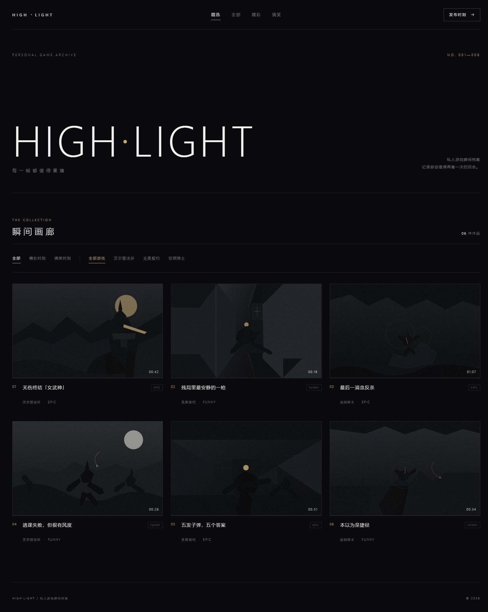

# HIGH·LIGHT

私人游戏高光与搞笑瞬间分享站。

> 每一帧都值得重播。

## 功能

- 三列极简画廊
- 作品详情与大播放器
- 极简文字反应栏
- 评论区
- 可视化发布作品
- 可视化删除作品

## 本地使用

双击 `启动网站.bat`，浏览器会自动打开网站。

发布、删除和修改作品的具体步骤见 [使用说明.md](使用说明.md)。

「发布时刻」和「作品管理」只在本机运行时显示。公开网址的访客只能浏览，不能修改仓库或线上网站。

## 发布到 GitHub Pages

仓库推送到 GitHub 后，可以在仓库的 `Settings > Pages` 中选择 `Deploy from a branch`，然后将 `main` 分支作为发布来源。
